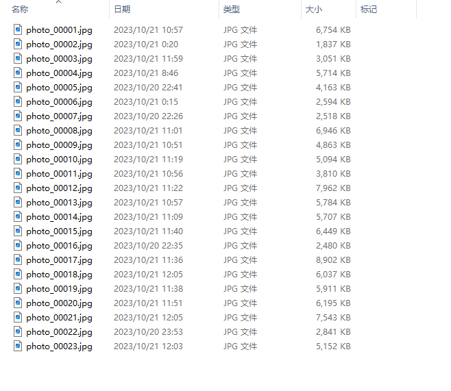

# rename

English | [简体中文](./README.md)

## Introduction
This project is used for batch renaming photos, so that the names in the renamed folder will not be messy.

## Instruction for use
There are three optional parameters for the application. The first parameter is the photo path, the second parameter is the length of the number, and the third parameter is the prefix of the photo name. All three parameters have default values, which are 'D:\\test', 5, and an empty string. You can follow the following command to rename:

```
python.exe .\rename.py 
python.exe .\rename.py D:/Download/test/
python.exe .\rename.py D:/Download/test/ 5
python.exe .\rename.py D:/Download/test/ 5 photo
```

The result of rename is shown in the following figure：


